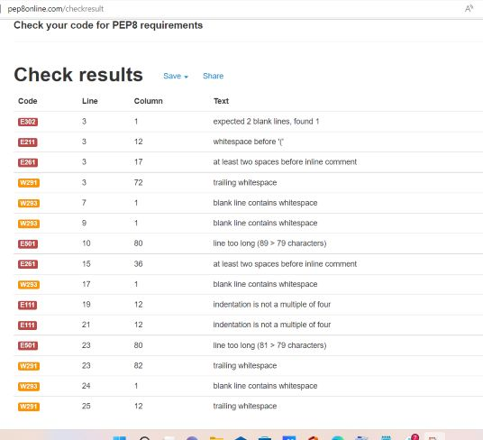

# LOTTERY WINS
Ultimate wins is a terminal numbers guessing game that can assist you to guess the correct potential winning numbers.
The idea here will be to create a simple game that can latter on be scaleble. 

# How To Play
It's simple. All you have to do to start with is guess any numbers betweet X and Y. The Game will keep evolving with time.

# Features
  * Random Genarator
    * Computer genarats a random number

# Bugs
found some via the pep8

# Credits
 
 https://python.plainenglish.io/building-an-old-school-text-based-game-with-python-efcc33d25a42

 https://www.sourcecodester.com/python
 
 https://www.freecodecamp.org/news/search/?query=python
